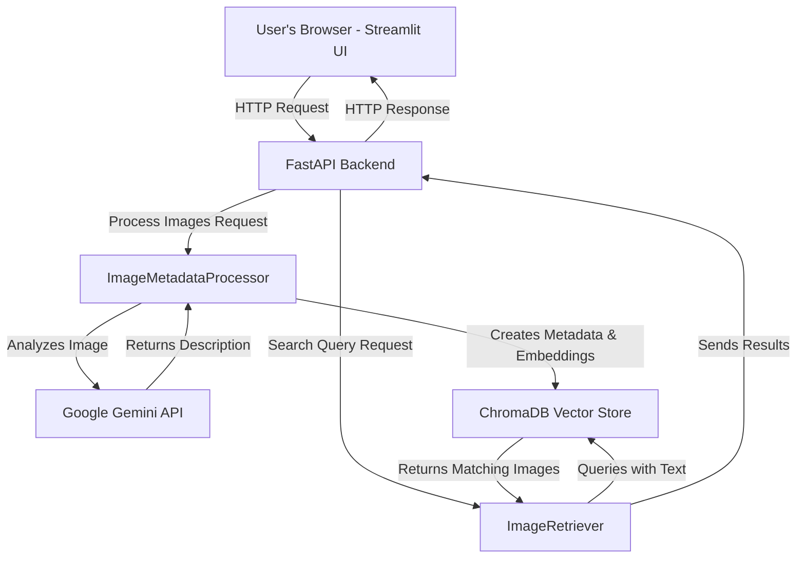

# 🖼️ Gemini-Powered Semantic Image Search

This project demonstrates a powerful text-to-image search application. It uses Google's Gemini 1.5 Flash to automatically generate descriptive metadata for your images and then leverages a vector-based semantic search to find images based on natural language queries.

The application is split into two main components:
1.  A **Streamlit web interface** for uploading images and querying.
2.  A **FastAPI backend** that handles the heavy lifting of image processing and searching.

## ✨ Features

* **AI-Powered Metadata Generation**: Uses Gemini 1.5 Flash to analyze images and extract rich metadata, including:
    * Number of people
    * Visible hand signs (e.g., thumbs-up, peace sign)
    * Landscape/setting description
    * Weather conditions
    * Overall mood
* **Semantic Search**: Go beyond simple keyword matching. You can search for images using natural language descriptions like "people enjoying a sunny day outdoors."
* **Vector-Based Retrieval**: Employs `ChromaDB` and `GoogleGenerativeAIEmbeddings` to create a searchable vector store of your images.
* **Interactive UI**: A user-friendly Streamlit interface allows you to:
    * Drag and drop multiple images for processing.
    * View generated metadata.
    * Search with pre-defined examples or custom queries.
    * See search results with matching metadata highlighted.
* **Decoupled Architecture**: The FastAPI backend is separate from the Streamlit frontend, making the system more robust and scalable.

## 🏗️ Architecture

The application follows a simple client-server architecture:

1.  **Streamlit Frontend (`app.py`)**: This is what you interact with in your browser. When you upload images, it sends them to the FastAPI backend. When you type a search query, it sends the query to the backend.
2.  **FastAPI Backend (`main.py` & `image_process.py`)**:
    * It receives the image paths from the frontend.
    * For each image, it calls the Gemini API to get a description.
    * It structures this description into a JSON format.
    * It creates a vector embedding of the metadata and stores it in ChromaDB.
    * When a search query is received, it queries the ChromaDB vector store to find the most relevant images.
3.  **Google Gemini AI**: The core intelligence of the application. It's responsible for understanding the content of your images.



## 🚀 Setup and Installation

### 1. Clone the Repository

```bash
git clone <your-repository-url>
cd <your-repository-directory>
```

### 2. Create a Virtual Environment

It's highly recommended to use a virtual environment to manage dependencies.

```bash
python -m venv venv
source venv/bin/activate  # On Windows, use `venv\Scripts\activate`
```

### 3. Install Dependencies

Install all the required libraries from the `requirements.txt` file.

```bash
pip install -r requirements.txt
```

### 4. Set Up Environment Variables

This project requires a Google Gemini API key.

1.  Create a file named `.env` in the root of your project directory.
2.  Add your API key to the `.env` file like this:

    ```
    GEMINI_API_KEY="YOUR_API_KEY_HERE"
    ```

## 🏃‍♀️ How to Run

You'll need to run both the backend server and the frontend application in separate terminal windows.

### 1. Start the FastAPI Backend

In your first terminal, run:

```bash
python main.py
```

You should see a message indicating that the Uvicorn server is running. By default, it will be available at `http://localhost:8000`.

### 2. Run the Streamlit Frontend

In your second terminal (make sure your virtual environment is activated here too), run:

```bash
streamlit run app.py
```

Your web browser should automatically open to the Streamlit application.

##  kullanımı How to Use

1.  **Upload Images**: Drag and drop one or more images into the file uploader.
2.  **Process Images**: Click the "Process Images" button. The app will send the images to the backend, where Gemini will analyze them.
3.  **Search**: Once processing is complete, a search bar will appear. You can:
    * Click one of the example search buttons.
    * Type your own descriptive query (e.g., "a group of friends outdoors").
4.  **View Results**: The application will display the images that best match your query, along with the metadata that was generated for each image.

## 📂 File Descriptions

* `app.py`: The main file for the Streamlit frontend application.
* `main.py`: The main file for the FastAPI backend. It defines the API endpoints.
* `image_process.py`: A module that contains the `ImageMetadataProcessor` and `ImageRetriever` classes, which handle the communication with the Gemini API and the vector store.
* `requirements.txt`: A list of all the Python packages required for this project.
* `.env`: Your local environment file for storing secrets like API keys.

## 🤔 Troubleshooting

* **Connection Error**: If the Streamlit app shows a "Cannot connect to FastAPI server" error, make sure the `main.py` script is running in a separate terminal and that there were no errors on startup.
* **API Key Issues**: If you get an error related to the API key, double-check that your `.env` file is correctly named and that the key is valid.
* **Image Processing Failures**: If image processing fails, check the console output of `main.py` for any specific error messages from the Gemini API. This could be due to rate limits or unsupported image formats.
